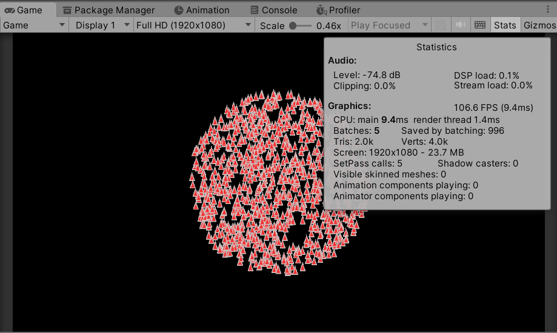

<a id="readme-top"></a>

[![Contributors][contributors-shield]][contributors-url]
[![Forks][forks-shield]][forks-url]
[![Stargazers][stars-shield]][stars-url]
[![Issues][issues-shield]][issues-url]
[![MIT License][license-shield]][license-url]


<!-- PROJECT LOGO -->
<br />
<div align="center">
  <a href="https://github.com/NamPhuThuy/Unity-Sample-Boids">
    
  </a>

<h3 align="center">Boid simulation</h3>
  <p align="center">
    <a href="https://github.com/NamPhuThuy/Unity-Sample-Boids">View Demo</a>
    ·
    <a href="https://github.com/NamPhuThuy/Unity-Sample-Boids/issues/new?labels=bug&template=bug-report---.md">Report Bug</a>
    ·
    <a href="https://github.com/NamPhuThuy/Unity-Sample-Boids/issues/new?labels=enhancement&template=feature-request---.md">Request Feature</a>
  </p>
</div>

[Boids Pseudocode](#boids-pseudocode)  
[Todo List](#todo)  
[Contact](#contact)  
[Acknowledgments](#acknowledgments)


<!-- ABOUT THE PROJECT -->
## Boids Pseudocode

The boids program has the following structure:
```
initialise_positions()
	    
LOOP
    draw_boids()
    move_all_boids_to_new_positions()
END LOOP
```

```
PROCEDURE move_all_boids_to_new_positions()

    Vector v1, v2, v3
    Boid b

    FOR EACH BOID b
        v1 = rule1(b)
        v2 = rule2(b)
        v3 = rule3(b)

        b.velocity = b.velocity + v1 + v2 + v3
        b.position = b.position + b.velocity
    END

END PROCEDURE
```

### Rule 1: Cohesion - boids try to fly towards the average position of neighbouring boids.

The average position of n-1 boids ():
```
pcJ = (b1.position + b2.position + ... + bJ-1.position + bJ+1.position + ... + bN.position) / (N-1)
```


<p align="right">(<a href="#readme-top">back to top</a>)</p>

## Rendering Optimize

1000 boids, chưa tối ưu, chưa gắn di chuyển

<!-- ROADMAP -->
## Todo

- [x] Add Changelog


See the [open issues](https://github.com/NamPhuThuy/Unity-Sample-Boids/issues) for a full list of proposed features (and known issues).

<p align="right">(<a href="#readme-top">back to top</a>)</p>


<!-- CONTACT -->
## Contact
[![LinkedIn][linkedin-shield]][linkedin-url]  
[![Facebook][facebook-shield]][facebook-url]  
[![Github][github-shield]][github-url]  
[![Itch][itch-shield]][itch-url]

<p align="right">(<a href="#readme-top">back to top</a>)</p>


<!-- ACKNOWLEDGMENTS -->
## Acknowledgments
Helpful resources, credits
* [GitHub Pages](https://github.com/NamPhuThuy)
* [Boids Pseudocode](http://www.kfish.org/boids/pseudocode.html)

<p align="right">(<a href="#readme-top">back to top</a>)</p>

<!-- MARKDOWN LINKS & IMAGES -->
<!-- https://www.markdownguide.org/basic-syntax/#reference-style-links -->
[contributors-shield]: https://img.shields.io/github/contributors/NamPhuThuy/Unity-Sample-Boids.svg?style=for-the-badge
[contributors-url]: https://github.com/NamPhuThuy/Unity-Sample-Boids/graphs/contributors
[forks-shield]: https://img.shields.io/github/forks/NamPhuThuy/Unity-Sample-Boids.svg?style=for-the-badge
[forks-url]: https://github.com/NamPhuThuy/Unity-Sample-Boids/network/members
[stars-shield]: https://img.shields.io/github/stars/NamPhuThuy/Unity-Sample-Boids.svg?style=for-the-badge
[stars-url]: https://github.com/NamPhuThuy/Unity-Sample-Boids/stargazers
[issues-shield]: https://img.shields.io/github/issues/NamPhuThuy/Unity-Sample-Boids.svg?style=for-the-badge
[issues-url]: https://github.com/NamPhuThuy/Unity-Sample-Boids/issues
[license-shield]: https://img.shields.io/github/license/NamPhuThuy/Unity-Sample-Boids.svg?style=for-the-badge
[license-url]: https://github.com/NamPhuThuy/Unity-Sample-Boids/blob/main/LICENSE

<!-- Contact -->
[linkedin-shield]: https://img.shields.io/badge/-LinkedIn-black.svg?style=for-the-badge&logo=linkedin&colorB=555
[linkedin-url]: https://www.linkedin.com/in/trinh-nam/
[facebook-shield]: https://img.shields.io/badge/-Facebook-blue.svg?style=for-the-badge&logo=facebook&colorB=3842c6
[facebook-url]: https://www.facebook.com/namphuthuy957
[github-shield]: https://img.shields.io/badge/-Github-blue.svg?style=for-the-badge&logo=github&colorB=252525
[github-url]: https://github.com/NamPhuThuy
[itch-shield]: https://img.shields.io/badge/-itch.io-blue.svg?style=for-the-badge&logo=itch.io&colorB=f5f5f5
[itch-url]: https://namphuthuy.itch.io/


<!-- Mock Up -->
[product-screenshot]: images/avatar.png

<!-- Tech Stack -->
[Next.js]: https://img.shields.io/badge/next.js-000000?style=for-the-badge&logo=nextdotjs&logoColor=white
[Next-url]: https://nextjs.org/
[React.js]: https://img.shields.io/badge/React-20232A?style=for-the-badge&logo=react&logoColor=61DAFB
[React-url]: https://reactjs.org/
[JQuery.com]: https://img.shields.io/badge/jQuery-0769AD?style=for-the-badge&logo=jquery&logoColor=white
[JQuery-url]: https://jquery.com 
[Unity.com]: https://img.shields.io/badge/Unity-61DBFB?style=for-the-badge&logo=unity&logoColor=white&labelColor=black&color=black
[Unity-url]: https://unity.com/
[CSharp.com]: https://img.shields.io/badge/C%23-61DBFB?style=for-the-badge&logo=c%23&logoColor=white&labelColor=magenta&color=purple

[CSharp-url]: https://learn.microsoft.com/en-us/dotnet/csharp/


